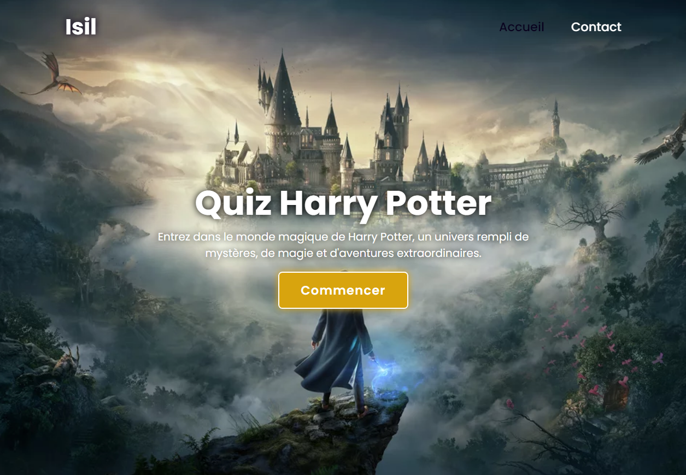
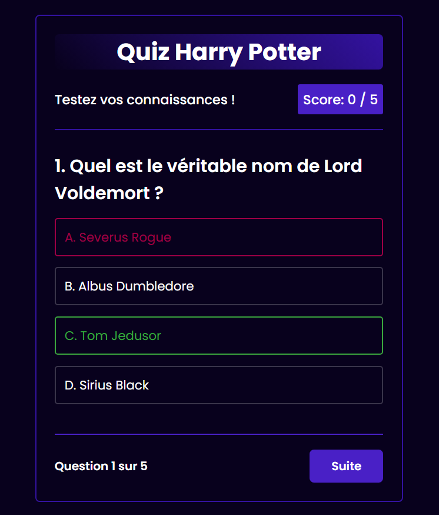

# Quiz Harry Potter 🦉

Ce projet est un quiz interactif sur l'univers de Harry Potter, développé avec HTML, CSS et JavaScript.

## Fonctionnalités

- **Questions variées** : Le quiz comporte une sélection de questions portant sur différents aspects de l'univers de Harry Potter, y compris les personnages, les lieux, les sorts et les événements clés.
- **Réponses interactives** : Les utilisateurs peuvent sélectionner leurs réponses à partir d'une liste d'options prédéfinies pour chaque question.
- **Feedback instantané** : Après avoir répondu à chaque question, les utilisateurs reçoivent un feedback instantané pour savoir s'ils ont répondu correctement ou non.
- **Score final** : À la fin du quiz, les utilisateurs peuvent voir leur score final et savoir combien de questions ils ont répondu correctement.

## Capture d'écran

## Comment utiliser

1. Cloner ce dépôt sur votre machine locale.
2. Ouvrir le fichier `index.html` dans votre navigateur web.
3. Répondez aux questions du quiz en sélectionnant les options appropriées.
4. Après avoir répondu à toutes les questions, consultez votre score final.

